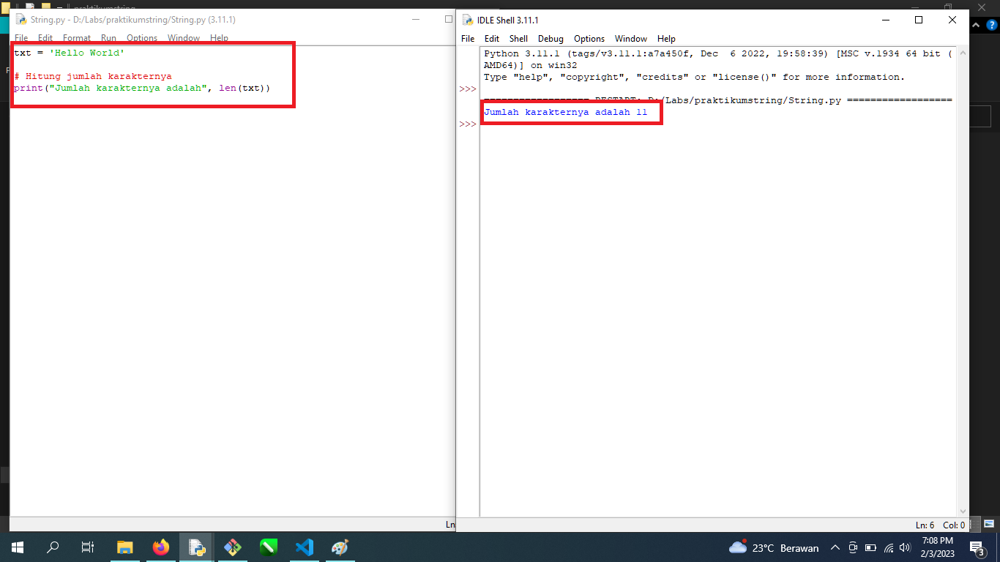
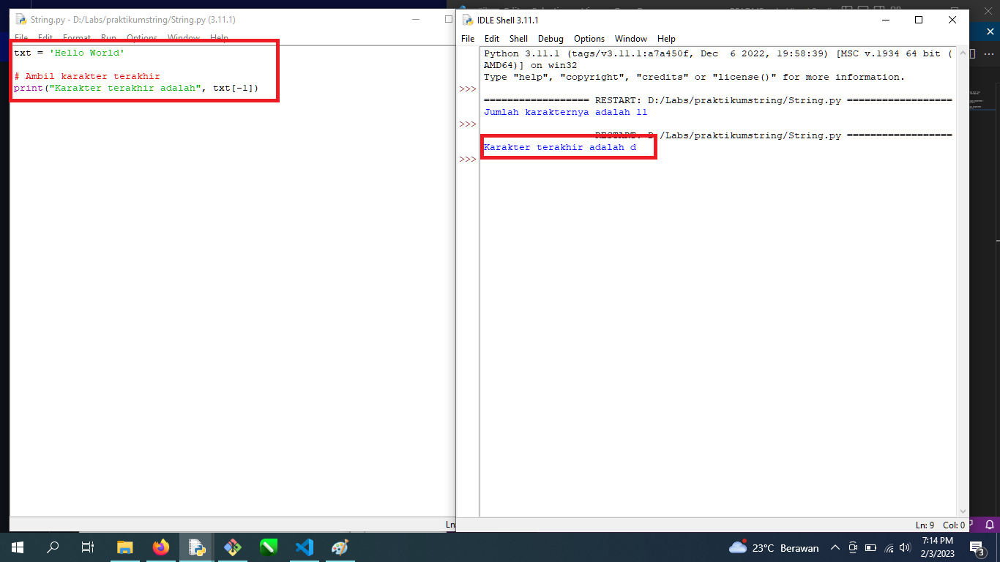
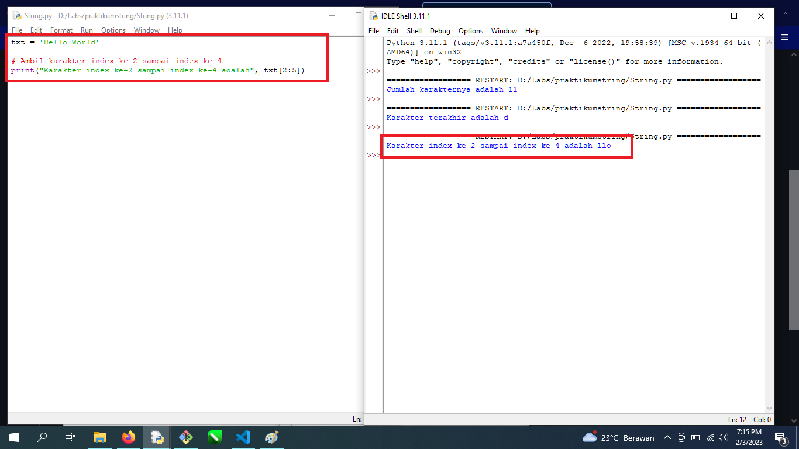
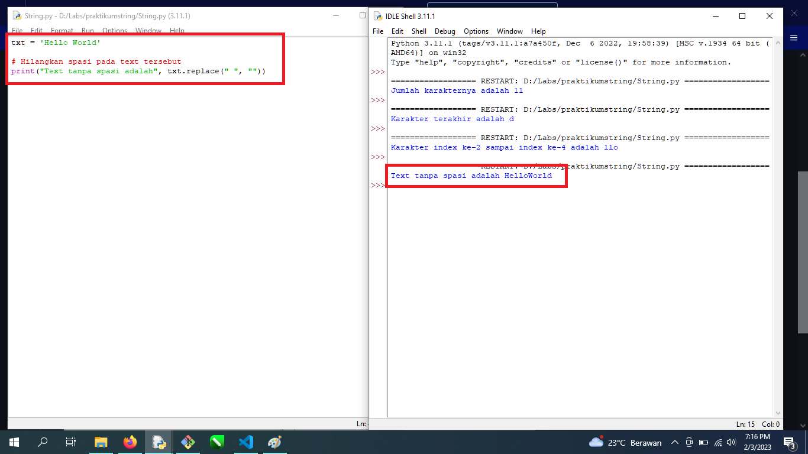
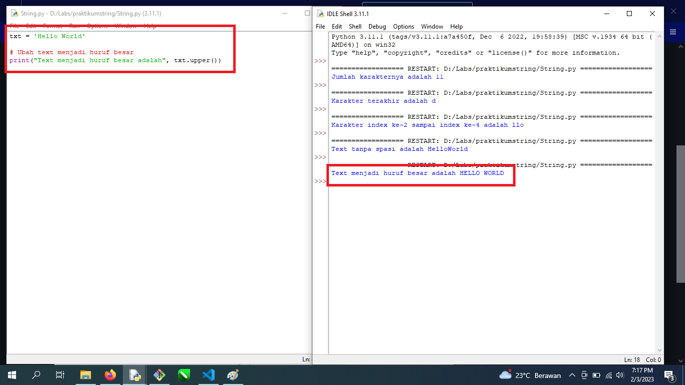
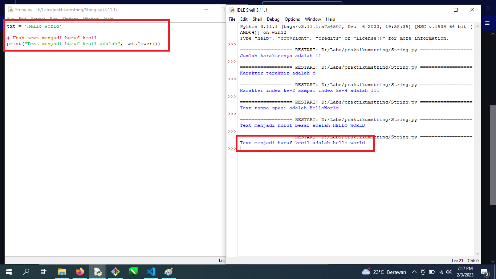
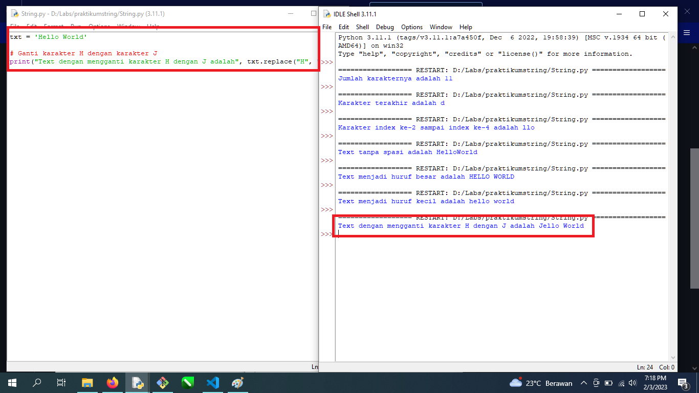
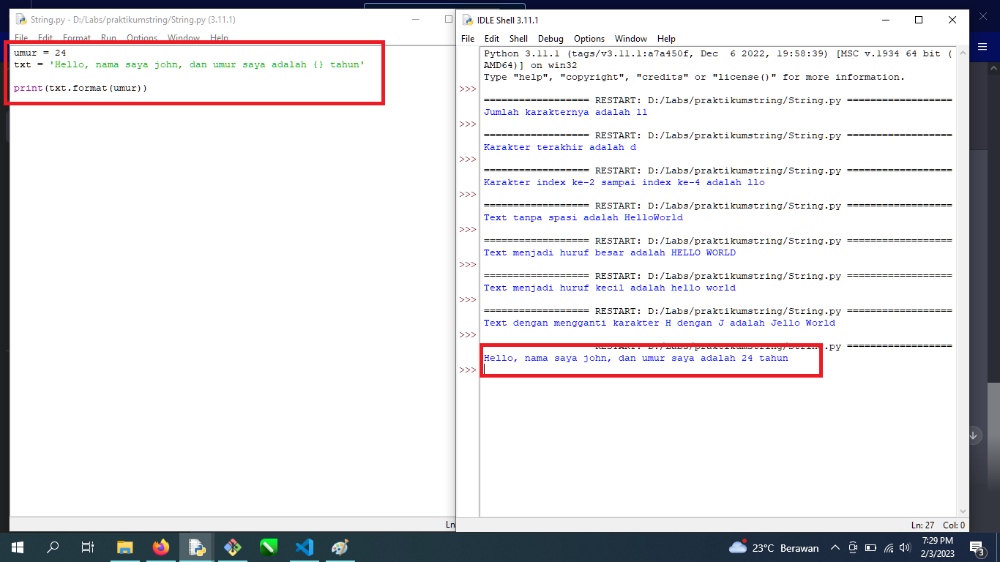

# praktikumstring

# Latihan 1
txt = 'Hello World' 
• Hitung jumlah karakternya
• Ambil karakter terakhir
• Ambil karakter index ke-2 sampai index ke-4 (llo)
• Hilangkan spasi pada text tersebut (HelloWorld)
• Ubah text menjadi huruf besar
• Ubah text menjadi huruf kecil
• Ganti karakter H dengan karakter J

Point 1 "Hitung Jumlah Karakternya" dengan mengetikkan :
print("Jumlah karakternya adalah", len(txt))

Point 2 "Ambil Karakter Terakhir" dengan mengetikkan :
print("Karakter terakhir adalah", txt[-1])

Point 3 "Ambil karakter index ke-2 sampai index ke-4 (llo)" dengan mengetikkan :
print("Karakter index ke-2 sampai index ke-4 adalah", txt[2:5])

Point 4 "Hilangkan spasi pada text tersebut (HelloWorld)" dengan mengetikkan :
print("Text tanpa spasi adalah", txt.replace(" ", ""))

Point 5 "Ubah text menjadi huruf besar" dengan mengetikkan :
print("Text menjadi huruf besar adalah", txt.upper())

Point 6 "Ubah text menjadi huruf kecil" dengan mengetikkan :
print("Text menjadi huruf kecil adalah", txt.lower())

Point 7 "Ganti karakter H dengan karakter J" dengan mengetikkan :
print("Text dengan mengganti karakter H dengan J adalah", txt.replace("H", "J")) dengan mengetikkan :

# Latihan 2
• Lengkapi kode berikut:
umur = 24
txt = 'Hello, nama saya john, dan umur saya adalah
... tahun'
print(txt.format(umur))

maka kita tambahkan "{}" menjadi :

umur = 24
txt = 'Hello, nama saya john, dan umur saya adalah {} tahun'
print(txt.format(umur))

maka outputnya akan menjadi :
